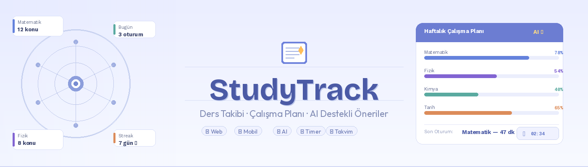

<p align="center">
  
</p>

<h1 align="center">📚 StudyTrack</h1>

<p align="center">
  <b>Ders Takibi • Çalışma Planı • AI Destekli Öneriler</b>
</p>

<p align="center">
  Yazılım Mühendisliği Dersi – Dönem Projesi
</p>

---

## 📌 Proje Tanımı

**StudyTrack**, öğrencilerin derslerini ve çalışma süreçlerini daha verimli yönetebilmesi amacıyla geliştirilmiş bir web ve mobil uygulamadır.

Uygulama; ders ekleme ve takip etme, çalışma oturumlarını başlatıp bitirme, geçmiş çalışma verilerini görüntüleme gibi temel özelliklerin yanı sıra **yapay zeka destekli kişisel çalışma planları oluşturma** imkanı sunar.

🎯 **StudyTrack bu probleme dijital ve akıllı bir çözüm sunmayı hedefler.**

---

## 🚀 Özellikler

### 🔐 Kullanıcı Yönetimi

* Kayıt olma
* Giriş yapma
* Çıkış yapma
* Profil güncelleme

### 📚 Ders Yönetimi

* Ders ekleme
* Ders listeleme
* Ders güncelleme
* Ders silme

### ⏱️ Çalışma Oturumları

* Çalışma başlatma
* Çalışma bitirme
* Geçmiş oturumları görüntüleme

### 🤖 AI Destekli Planlama

* Yapay zeka ile çalışma planı oluşturma
* Kişisel çalışma önerileri

---

## 🔗 Canlı REST API

🚀 **Swagger UI (Canlı API Dokümantasyonu):**
👉 https://studytrack-api-nu1x.onrender.com/swagger/index.html

---

## 📄 Dokümantasyon

* 📑 [Gereksinim Analizi](./Nisa-Nur-Akyildiz/Gereksinim-Analizi.md)
* 📘 [REST API Tasarımı](./openapi.yaml)
* 📗 [REST API Detayları](./Rest-API.md)
* 💻 [Web Front-End](./WebFrontEnd.md)
* 📱 [Mobil Front-End](./MobilFrontEnd.md)
* ⚙️ [Mobil Backend](./MobilBackEnd.md)
* 🎥 [Video Sunum](./Sunum.md)

---

## ⚙️ Kullanılan Teknolojiler

| Katman             | Teknoloji         |
| ------------------ | ----------------- |
| Backend            | Node.js / Express |
| Web Frontend       | React             |
| Mobil              | React Native      |
| Veritabanı         | PostgreSQL        |
| API Dokümantasyonu | OpenAPI / Swagger |

---

## 🛠️ Kurulum

### 1. Repo'yu klonla

```bash
git clone https://github.com/kullaniciadi/studytrack.git
cd studytrack
```

### 2. Backend başlat

```bash
cd backend
npm install
npm run dev
```

### 3. Frontend başlat

```bash
cd frontend
npm install
npm run dev
```

---

## 👩‍💻 Geliştirici

<p align="center">
  <b>Nisa Nur Akyıldız</b>
</p>

---

## ⭐ Not

Bu proje, Yazılım Mühendisliği dersi kapsamında geliştirilmiştir ve eğitim amaçlıdır.
